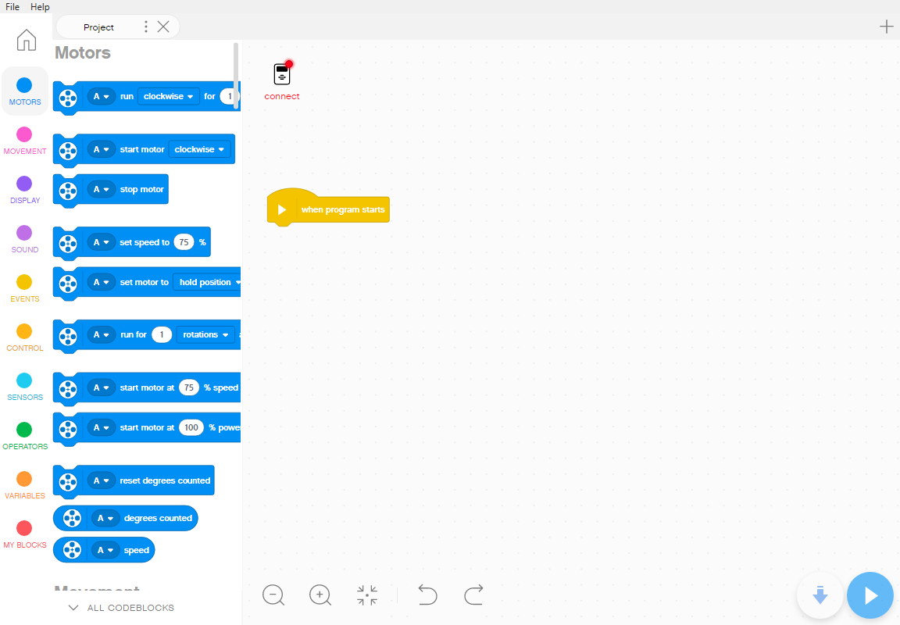
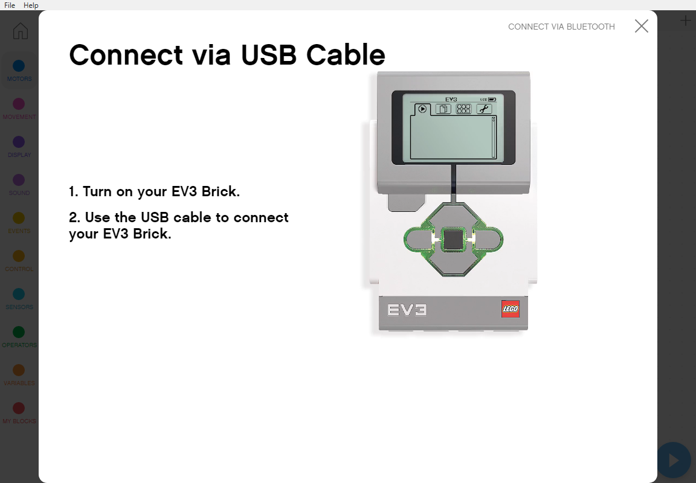
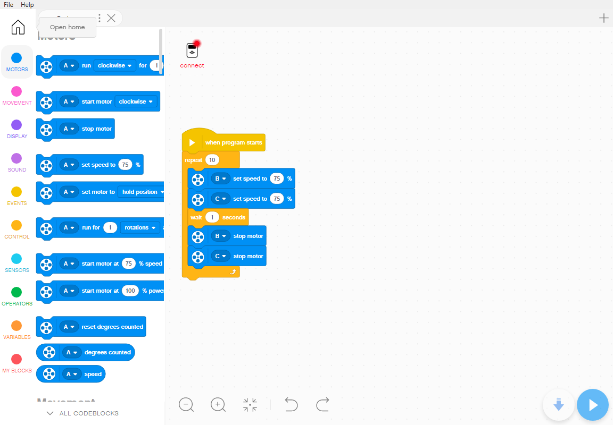
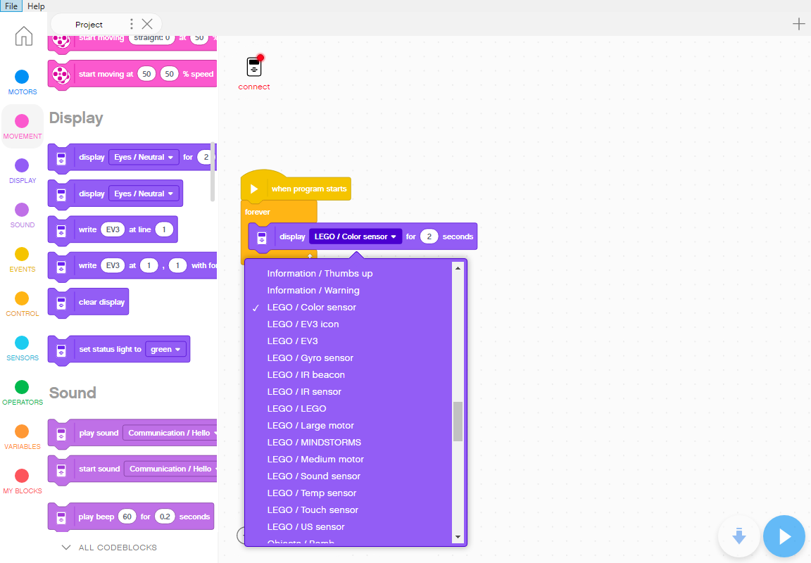
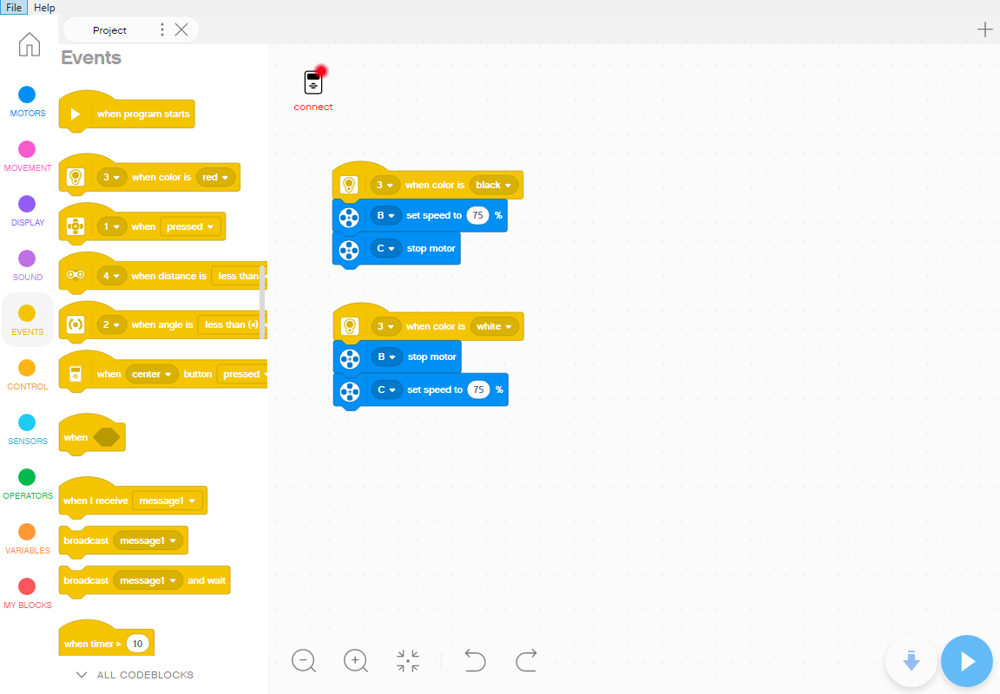
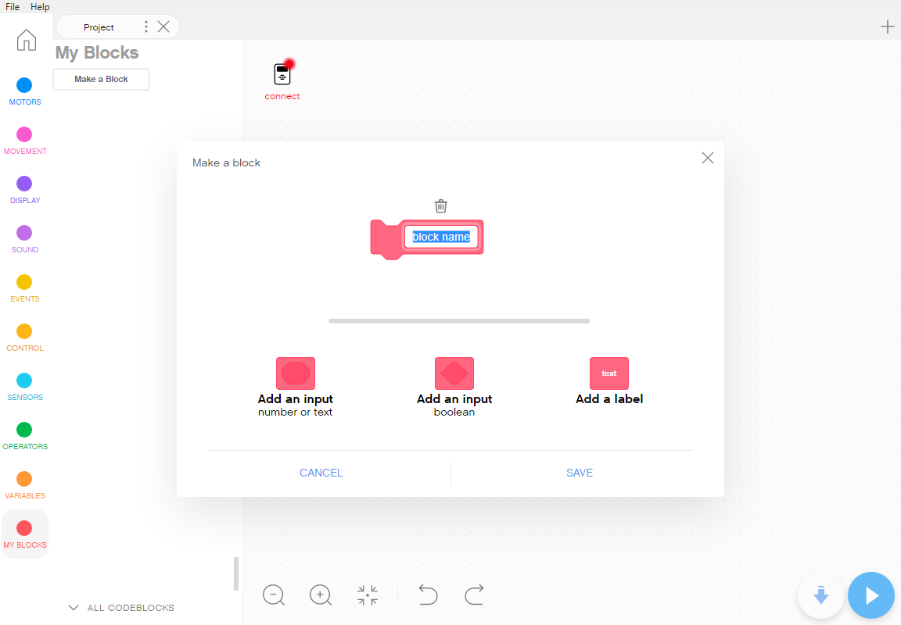
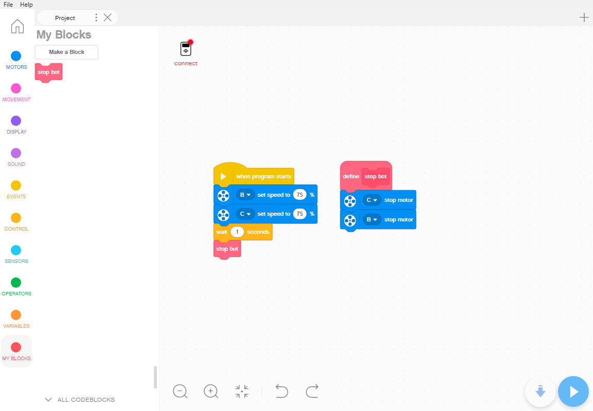

<!--
author:   David Croft
email:    david.croft@warwick.ac.uk
version:  0.1.0
language: en
narrator: US English Male

classroom: false
icon: https://dscroft.github.io/liascript_materials/assets/logo.svg

import: https://dscroft.github.io/liascript_materials/assets/utils.md

@style
.flex-container {
    display: flex;
    flex-wrap: wrap; /* Allows the items to wrap as needed */
    align-items: stretch;
    gap: 20px; /* Adds both horizontal and vertical spacing between items */
}

.flex-child { 
    flex: 1;
    margin-right: 20px; /* Adds space between the columns */
}

.ev3display {
  color: white; 
  font-weight: bold;
  padding-left: 5px;
  padding-right: 5px;
  background-color: #935df5;
}

.ev3event {
  color: white; 
  font-weight: bold;
  padding-left: 5px;
  padding-right: 5px;
  background-color: #f5c400;
}

.ev3motor {
  color: white; 
  font-weight: bold;
  padding-left: 5px;
  padding-right: 5px;
  background-color: #0090f5;
}

.ev3my {
  color: white; 
  font-weight: bold;
  padding-left: 5px;
  padding-right: 5px;
  background-color: #ff6680;
}

.ev3mysection { 
  font-weight: bold;
  color: #ff6680
}

.ev3sensor {
  color: white; 
  font-weight: bold;
  padding-left: 5px;
  padding-right: 5px;
  background-color: #1dccf0;
}


@media (max-width: 600px) {
    .flex-child {
        flex: 100%; /* Makes the child divs take up the full width on slim devices */
        margin-right: 0; /* Removes the right margin */
    }
}
@end
-->

# Sensor Metrics and Characterisation


## Robot fight?

!?[Robot fight?](https://youtu.be/KwDUMVrHdZg?start=203)


## Learning Outcomes

By the end of this session you will be able to understand:

- How to use (basic) sensor(s) to implement navigation features (line following).
- How to access sensor data.
- How to characterise sensors.
- How sensor limitations can affect function performance.
- Sensor metrics and its measurement.

<!--
style="background-color: firebrick; color: white"
-->
>⚠️**Warning**
>
> Take detailed notes and plots/pictures of your testing activities.
>
> - IMA related!


## Outline

@TableOfContents(1)


# LEGO EV3 vehicles hardware


## EV3 Brick

[EV3 userguide](https://le-www-live-s.legocdn.com/ev3/userguide/1.4.0/ev3_userguide_enus.pdf)


## Vehicle Chosen

1. The 2 Large Servo Motors are connected to the wheels of the vehicle.
2. The Medium Servo Motor is connected to the carriage arm at the front of the vehicle.
3. The Colour Sensor is at the front of the vehicle, pointing downwards.
4. The Touch Sensor is at the front of the vehicle facing forward.
5. The Ultrasonic Sensor is at the front of the vehicle.
6. The EV3 Brick is at the top of the vehicle.
7. The Gyro Sensor is mounted on top of the EV3 Brick.
8. The Infrared Sensor is mounted as the 'front face' of the vehicle.


<!-- style="display:none" -->
TODO: add numbers to the image.


### Gyro Sensor


| Maximum Speed          | Accuracy                             |
| ---------------------- | ------------------------------------ |
| 440 degrees per second | (+/-) 3 degrees for a 90 degree turn |


### Colour Sensor 

Also used as Light Sensor.


| Mode                      | Description                                                             | Specification                                          | Notes                                                  |
| ------------------------- | ----------------------------------------------------------------------- | ------------------------------------------------------ | ------------------------------------------------------ |
| Colour                    | Recognises 7 colours                                                    | Black, blue, green, yellow, red, white and brown       | Must be held close to the surface and at a right angle |
| Reflected Light Intensity | Measures intensity of a red light reflected back.                       | Scale of 0 to 100                                      | Must be held close to the surface and at a right angle |
| Ambient Light Intensity   | Measures intensity of light from the environment that enters the window | Sample rate of 1kHz/sec                                |                                                        |


### Ultrasonic Sensor


| Description                                                           | Detectable Distance  | Accuracy  | Notes                                                                    |
| --------------------------------------------------------------------- | -------------------- | --------- | ------------------------------------------------------------------------ |
| Distance to an object can be measured in either inches or centimeters | Between 3cm to 250cm | (+/-) 1cm | Presence mode detects other ultrasound sources but does not transmit any |


### Infrared Sensor


| Mode      | Description                                                                                                                                                             | Working Distance |
| --------- | ----------------------------------------------------------------------------------------------------------------------------------------------------------------------- | ---------------- |
| Proximity | Light waves reflected back are used to estimate the distance to the object. It reports the distance as values between 0 (very close) to 100 (far away).                 | Up to 70cm       |
| Beacon    | The sensor will detect a beacon signal matching one of four channels that you specify. Direction shows values between -25 and 25 whilst proximity is between 0 and 100. | Up to 200cm      |


### Touch Sensor

A simple on/off button. Can be used to allow human interference in running of the programme or as a trigger.


### EV3 Brick

- The EV3 Brick contains an ARM 9 processor.
- 4 Inputs (for reading and recording sensor information) and 4 Outputs (for driving the motors).
- It also has a speaker on board which can be programmed in EV3.
- Can connect using USB, or with the use of WIFI or Bluetooth dongles.
- On board memory storage to log sensor data.


# LEGO EV3 software

The EV3 can support and can interact with a wide range of possible languages.

- EV3 - default block programming suite (later in the slides)
- C Language/ROBOT C
- Java
- Python
- Scratch
- MATLAB & Simulink

For this lab will be using MATLAB and/or the official EV3 software.

Data logging
============

Data logging can be crucial in order to understand why and how a particular autonomous vehicle behaves the way it does
It helps to verify whether the software and hardware are behaving in the intended manner

We will be recommending two methods of data logging.

- Matlab data logging.
- Brick data logging.


## Brick Data Logging

This form involves setting up the data collection
parameters on the brick itself instead of using
external software.

- The data can then be viewed on the brick.

<section class="flex-container">
<!-- class="flex-child" style="min-width: 250px" -->
- Start the brick up and go to the 3rd tab in the menu to find 'Brick Datalog'.

<!-- class="flex-child" style="min-width: 250px" -->

</section>

------------------------------------

<section class="flex-container">
<!-- class="flex-child" style="min-width: 250px" -->
- Click on Settings Icon to change the configurations.

<!-- class="flex-child" style="min-width: 250px" -->

</section>

------------------------------------

<section class="flex-container">
<!-- class="flex-child" style="min-width: 250px" -->
- Click on the icon with numbers to see data from different sensors .

<!-- class="flex-child" style="min-width: 250px" -->

</section>

------------------------------------

<section class="flex-container">
<!-- class="flex-child" style="min-width: 250px" -->
- Click on sphere icon to start/stop collecting data.

<!-- class="flex-child" style="min-width: 250px" -->

</section>


## Matlab Data Logging

Matlab Data Logging involves the establishment of a connection between the EV3 brick and external Matlab software using either Bluetooth, WIFI, or a USB; in order to attain real-time data from the sensors

Make sure that:

- You have a copy of MATLAB open.

- The LEGO EV3 support package is installed.
  
  - If not, see [here](https://uk.mathworks.com/help/matlab/supportpkg/install-support-for-lego-mindstorms-ev3-hardware.html). 

- The EV3 is connected to the computer via USB.
- The EV3 is turned on.

These instructions were confirmed for Matlab 2022b and 2024a.
They should work in other versions but were not tested.

For further documentation see [here](https://uk.mathworks.com/help/matlab/legomindstormsev3io.html).


### Example 1 - Test sensors

Create a new script and copy the following code.

When ready, run the script.

- A single reading from each sensor will be taken and output.

``` matlab
% test if ev variable already exists, if not, create it
if ~exist('ev', 'var')
    ev = legoev3('USB');
end

fprintf( "Connected Sensors:\n" )
% iterate through connected sensors
for i = 1:length( ev.ConnectedSensors )
    fprintf( "  %d: %s\n", i, ev.ConnectedSensors{i} )
end

% assuming that sensors are connected to default ports
ir = irSensor( ev, 1 );
fprintf( "IR: %d\n", readProximity( ir ) );

color = colorSensor( ev, 2 );
fprintf( "Intensity: %d\n", readLightIntensity( color ) );

gyro = gyroSensor( ev, 3 );
fprintf( "Gyro: %d\n", readRotationAngle( gyro ) );

sonar = sonicSensor( ev, 4 );
fprintf( "Sonar: %f\n", readDistance( sonar ) );
```


### Example 2 - Move motors

When run this script moves the robot, forward, turns, then stops.

``` matlab
% config
speed = 20;

% test if ev variable already exists, if not, create it
if ~exist('ev', 'var')
    ev = legoev3('USB');
end

% initalise and start motors
left = motor( ev, 'A' );
right = motor( ev, 'D' );
start(left);
start(right);

% forward
left.Speed = speed;
right.Speed = speed;

pause( 1 );

% turn left
left.Speed = -speed;

pause( 1 );

% stop
left.Speed = 0;
right.Speed = 0;
```


### Example 3 - Log data

When run this script logs proximity data from the IR sensor over time and plots it.

- Try adjusting the update rate and collection period.
- Try changing the sensor that is being read.

``` matlab
function historicValues = mainloop( ev, updateRate, runFor )
    % config
    if nargin < 2
        updateRate = 10; % Hz
    end
    if nargin < 3
        runFor = 30; % seconds
    end

    % connect to ir sensor
    ir = irSensor( ev, 1 );

    % initalise loop variables
    historicValues = [];
    startTime = tic;
    figure;

    while toc( startTime ) < runFor
        % Read the color sensor
        prox = readProximity( ir );
        historicValues = [historicValues; prox];

        fprintf( 'Proximity: %d\n', prox );

        % Plot the intensity values
        plot( historicValues, 'LineWidth', 2 );
        title( 'Value Over Time' );
        xlabel( 'Reading' );
        ylabel( 'Value' );
        
        % Force MATLAB to update the figure immediately
        drawnow;

        pause( 1.0 / updateRate );
    end
end

% test if ev variable already exists, if not, create it
if ~exist('ev', 'var')
    ev = legoev3('USB');
end

values = mainloop( ev );
```


### Example 4 - Multiple plots

An example of logging and plotting multiple sensors at the same time.

``` matlab
function historicValues = mainloop( ev, updateRate, runFor )
    % config
    if nargin < 2
        updateRate = 10; % Hz
    end
    if nargin < 3
        runFor = 30; % seconds
    end

    % connect to sensors
    ir = irSensor( ev, 1 );
    sonar = sonicSensor( ev, 4 );

    % initalise loop variables
    historicValues = [];
    startTime = tic;
    figure;

    while toc( startTime ) < runFor
        prox = readProximity( ir );
        dist = readDistance( sonar );

        % convert sonar to cm
        dist = dist * 100;

        historicValues = [historicValues; prox, dist];

        fprintf( 'Proximity: %d, distance: %f\n', prox, dist );

        % Plot the intensity values
        plot( historicValues, 'LineWidth', 2 );
        title( 'Value Over Time' );
        xlabel( 'Reading' );
        ylabel( 'Value' );

        % add legend
        legend( 'IR', 'Sonar' );
        
        % Force MATLAB to update the figure immediately
        drawnow;

        pause( 1.0 / updateRate );
    end
end

% test if ev variable already exists, if not, create it
if ~exist('ev', 'var')
    ev = legoev3('USB');
end

values = mainloop( ev );
```


### Example 5 - Sense/Act

An example of the bot responding to input. In this case the bot will move forward until an obstacle is detected.

``` matlab
function historicValues = mainloop( ev, updateRate )
    % config
    if nargin < 2
        updateRate = 10; % Hz
    end

    % connect to sensors
    sonar = sonicSensor( ev, 4 );

    % initalise and start motors
    left = motor( ev, 'A' );
    right = motor( ev, 'D' );
    start(left);
    start(right);

    while true
        dist = readDistance( sonar );

        % convert sonar to cm
        dist = dist * 100;

        if dist > 10
            fprintf( 'Moving forward\n' );
            % move forward
            left.Speed = 20;
            right.Speed = 20;
        else
            fprintf( 'Stopping\n' );
            % stop
            left.Speed = 0;
            right.Speed = 0;
        end

        pause( 1.0 / updateRate );
    end
end

% test if ev variable already exists, if not, create it
if ~exist('ev', 'var')
    ev = legoev3('USB');
end

values = mainloop( ev );
```


## Block software

The EV3 can be programmed using the default block programming suite, available [here](https://education.lego.com/en-gb/downloads/mindstorms-ev3/software/).

But this is extremely limited in terms of data logging functionality.
It may be useful for used to complete the activities but we would recommend that Matlab is used for the initial data logging.



### Connecting ev3




### Motor control

Motors can be controlled in various ways using the motor <!--class="ev3motor"--> blocks.

Either rotated specific amounts or set to specific speeds and infinite rotation.



<!-- style="display:none" -->
```bash
for img in *.png; do
  convert "$img" -gravity north -chop x24 -gravity south -chop x40 "$img"
done
```

### Sensor data

Sensor data can be read and basic comparisons done using the sensor<!--class="ev3sensor"--> blocks.


<!-- style="display:none" -->
```bash
for img in *.png; do
  convert "$img" -gravity north -chop x24 -gravity south -chop x40 "$img"
done
```


### Display data

Limited sensor information can be displayed on the EV3 screen using the display<!--class="ev3display"--> block.

Select the relevant sensor from the drop-down menu in the block.


Custom displays can be created using the write<!--class="ev3display"--> blocks.





### Control architecture

There are two main approaches to control architecture:

1. Single main loop that repeatedly polls the sensors and updates the actuators.

  - Using a single event<!--class="ev3event"--> block.


-----------------

2. Callback architecture where sensor value changes trigger behaviors.

  - Using one event<!--class="ev3event"--> block per trigger.




### Functions

Functional programming can be achieved by creating custom blocks in the 
<span class="ev3mysection">MY BLOCKS</span> section.

Use a define<!--class="ev3my"--> block to specify your function.
Then place your custom block to call the function.






# Activities

We are building the sensor suite for our Level 4 LEGO vehicle.

- You will use the info collected today for your IMA.
- To achieve that we are going to decompose our function.

------------------

1. Navigation following a pre-defined path (30 min)
2. Look at the sensor data and refine your function (30 min)
3. Sensor characterization & obstacle detection (90 min)

    - NOTE: measurements of the above activity are very important for your PMA.
4. Navigation with pre-defined path and obstacles (remaining time - if any).


Equipment available
===============

- 1 or 2 robots per group.
- Laptops with TODO installed (do not use home edition!).
- Tiles with different paths.
- Spare batteries and sensors.
- Different obstacles (materials, sizes, shapes).
- Measuring tapes.


### Activity 1 - Constrained navigation

- In an urban environment we imagine to have predefined (and geo fenced) paths for the vehicles.
- Our L4 LEGO vehicles shall be able to navigate the environment following the black line.
- We are going to rely initially on just one sensor (colour sensor).

 

- Try to create a program that controls the vehicle
- You are going to use the Colour **Sensor** and the Large Servo Motor **Actuators**.
- Decomposition of the function (remember think computationally!):

  - Your vehicle must be able to detect the black path using the Colour Sensor.
  - Your vehicle must follow this path (being driven by the motors).

<!-- style="max-width: 400px" -->


Some considerations
===================

- Is your detection robust?

  - What happens if there is less light? 
  - If we have a line of another colour? 
  - If the line is not continuous?
- Is your algorithm robust?

  - Can you compensate for any issues as above?
  - Do you need more sensors? (and therefore more money?)
- Any ideas on how to improve it your basic navigation?


### Activity 2 - Sensor data logging

Understanding data readings is fundamental for autonomous vehicles.

- Using one (or more) of the sensor data logging techniques, download the data from your sensors (colour and gyro).
- Understand your data 

  - *Optional - plot them.*
- Can you use the data to improve your control?

 

<!-- style="display:none" -->
https://goo.gl/images/mRQUWU https://goo.gl/images/L9msRF


### Activity 3 - Obstacle detection

Once you be are able to navigate your geo fenced area, 
the vehicle needs to be able to detect obstacles.

- We would like it to avoid pedestrians, other vehicles, orange cones, etc.
- To carry out this task you need to characterise your available sensors


Obstacle detection
==================

Understand sensor performance:

- What are the noise factors that can affect the performance of the sensors?
- You will be given obstacles of different sizes and different materials.
- You can use different types of sensors: US, colour, IR.
- You have to characterise their performance.

  - Range max and min, resolution, field of view (H & V), material, position
- How are they affected by environmental condition?
  
  - Light?
  - Multiple targets?
  - Materials? 
  - Are there preferred sensor type(s) depending on the target?
- Functional or non-functional testing?

- *HINT: For this activity, you may need to use sensor data logging.*

  - Record as much of your data because you are going to need them in your assignment.


### Activity 4 - Navigation and obstacle detection

You now have to combine what you have learned from the previous activities.

- Your vehicle must follow the black path.
- When there is a detected obstacle in the path your vehicle must stop or go around the obstacle.


<!-- style="display:none" -->
https://goo.gl/images/F7iR1z


Optimise your use of sensors and their combination
to get through the path as fast as possible without
bumping the obstacles

- Is it work implementing some high level sensor fusion?
  
  - Do certain sensors have priority?
  - Are they read at the same time?
  - How fast they are?


# Conclusion

Even if we have used simplified vehicles with few sensors, 
the sensor performance is crucial to achieve simple tasks.

- Data sensor logging can be used to improve our testing efficiency but also the quality of the control algorithm(s)
- We have used very simple control loops.
- The final performance of our sensor(s) will determine the performance of our function(s):

  - Is sensor fusion the solution?
  - Or it is just another engineering tradeoff?

 

<!-- style="display:none" -->
https://goo.gl/images/VTTunS https://goo.gl/images/WMyXTM


